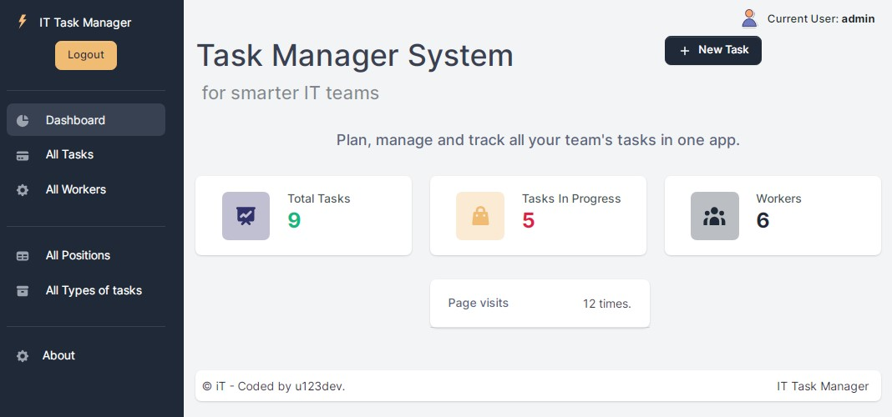

# IT Task Manager System 
> #### _for smarter IT teams_


Plan, manage and track all your team's tasks in one app.

A task management app is a digital way to keep track of workers’ tasks and deadlines.

___

- Make worker task tracking easier by managing all tasks right from app.


- Set up tasks with due dates to automate daily assignments.


- Add detailed descriptions so workers know exactly what needs to be done.

### System requirements

* **Python 3.10+ (need to be installed)**
* Django 5.+ (will be install automatically )

## Installing 

1. Clone GitHub repository:
```
git clone https://github.com/u123dev/IT-Task-Manager.git
```
  - You can get the link by clicking the `Clone or download` button in your repo

2. Open the project folder in your IDE
3. Make virtual environment and install requirements in it:
```
py -m venv venv
venv\Scripts\activate (on Windows)
source venv/bin/activate (on macOS)
pip install -r requirements.txt
```
4. Migrate & make database:
```
py manage.py migrate
```
4. Load demo data from fixture:
```
py manage.py loaddata data_db.json
```
5. After loading demo data you can use test user:
  - Login: `admin`
  - Password: `admin`
6. Run project:
```
py manage.py runserver
```
7. Access Task Manager in your browser: [http://127.0.0.1:8000/](http://127.0.0.1:8000/)

## Features
The Dashboard is available to all visitors.
It provides common information about the total tasks, 
tasks in progress and employees.

Access to the main part is available only to authorized users.

Create new task by **`+ New Task`** button.

### Functionality:
* **Authentication** for Worker -  secure Login/Logout
* **Processing Tasks** - create, update, delete, search, view and assign to worker, set status when done.
* **Workers** - create, update, delete, search, filter related tasks, by status etc.
* Also managing workers **Positions** & **Types of tasks** 

### Demo


